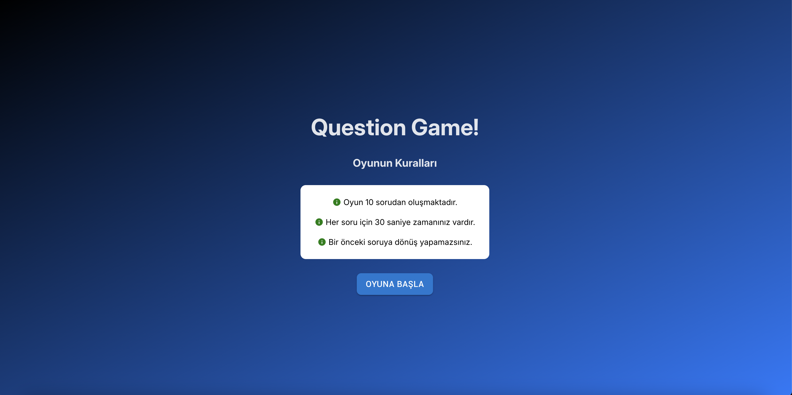

# Question App - React

A modern React-based quiz application featuring Material-UI for styling, dynamic state management with Context API, and additional functionalities like timers and expandable cards.

## Features
- Dynamic Quiz Management: State-driven quiz functionality using React Context API.
- Material-UI Design: Leveraging Material-UI components for clean and responsive UI.
- Timer Integration: Each question is timed with configurable durations.
- Expandable Cards: Questions include expandable sections for additional information.
- Answer Visibility Control: Options are hidden for the first few seconds of each question.
- Real-time Feedback: Shows correct, incorrect, and unanswered questions after completion.

## Live Demo
You can view the live version of this project here: [Live Site](https://gleeful-meerkat-251418.netlify.app/)

## Technologies Used
- **React**: Core library for building the UI and managing component state.
- **Material-UI**: For styled components and responsive design.
- **Context API**: For state management across the application.
- **CSS**: For additional styling and animations.
- **JavaScript (ES6+)**: For implementing application logic.

## Screenshot
Below is a preview of the project:

## Installation and Setup
1. Clone the repository
2. Run `npm install` to install dependencies
3. Run `npm start` to launch the development server
4. Open your browser to `http://localhost:3000`

---
For any inquiries or issues, please feel free to contact [Muhammed Talha Ergüney](mailto:talhaergy@gmail.com).
